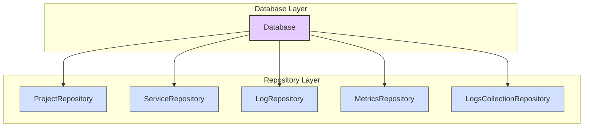
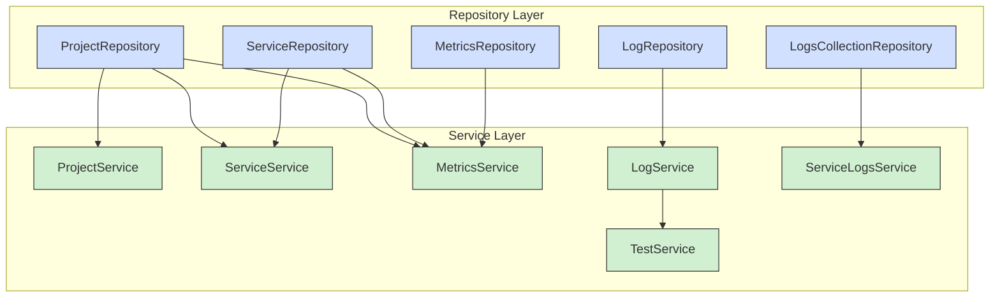
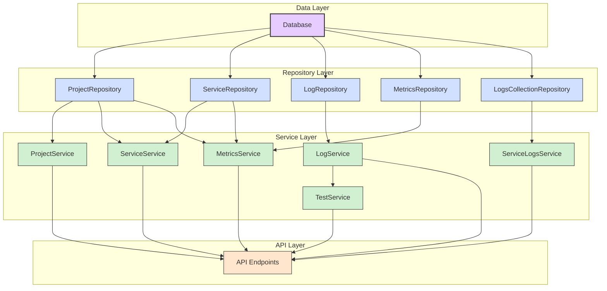

# Poly Micro Manager - Backend Architecture Documentation

## Architecture Overview

The Poly Micro Manager backend implements a **Layered Microservices Architecture** with a clear separation of concerns. This architecture follows modern best practices for building scalable, maintainable, and testable backend systems. The backend is fully implemented with a FastAPI server connected to MongoDB for data persistence.

### Architectural Layers

1. **API Layer**: Handles HTTP requests/responses and routing
2. **Service Layer**: Contains business logic and orchestrates operations
3. **Repository Layer**: Manages data access and persistence
4. **Schema Layer**: Defines data structures and validation
5. **Core Layer**: Houses configuration and shared utilities

### Key Architectural Principles

- **Separation of Concerns**: Each component has a single responsibility
- **Dependency Injection**: Services and repositories are injected where needed
- **Repository Pattern**: Abstracts data access operations
- **Single Responsibility Principle**: Each module handles one aspect of functionality
- **Open/Closed Principle**: Components can be extended without modification

## Directory Structure

```
poly-micro-backend/
├── app/                 # Application package
│   ├── api/             # API layer
│   │   ├── dependencies/# Dependency injection
│   │   └── routes/      # API routes by domain (projects, services, logs, metrics)
│   ├── core/            # Core utilities and configuration
│   ├── db/              # Database layer
│   │   └── repositories/# Data access repositories
│   ├── models/          # Domain models (if needed)
│   ├── schemas/         # Pydantic models for validation and serialization
│   └── services/        # Business logic services
├── .env                 # Environment variables (local only)
├── .env.example         # Example environment variables
├── requirements.txt     # Dependencies
└── run.py               # Application entry point
```

## Component Descriptions

### API Layer

The API layer is responsible for handling HTTP requests and responses. It's organized around domain resources (projects, services, logs, metrics) with each having its own router. This allows for a clean separation of API endpoints.

#### Key Features:
- RESTful API design
- Route grouping by domain
- Proper HTTP status codes
- Clear dependency injection

### Service Layer

The service layer contains the business logic and orchestrates operations between multiple repositories. It's responsible for validating input, coordinating data access, and implementing the application's business rules.

#### Key Features:
- Independent of web frameworks
- Reusable business logic
- Focused on domain operations
- Proper exception handling

### Repository Layer

The repository layer abstracts data access operations, making it easier to switch database implementations or add caching. Each repository is responsible for a specific domain entity.

#### Key Features:
- MongoDB integration
- Generic CRUD operations
- Domain-specific query methods
- Transaction support

### Schema Layer

The schema layer defines data structures using Pydantic models. It handles validation, serialization, and deserialization.

#### Key Features:
- Input validation
- Response serialization
- Clear data models
- Separation between input and output models

### Core Layer

The core layer contains configuration, utilities, and other shared components used throughout the application.

#### Key Features:
- Configuration management
- Environment variable handling
- Sample data generation
- Utility functions

## API Endpoints

### Projects
- `GET /api/projects` - List all projects
- `GET /api/projects/{project_id}` - Get project by ID
- `POST /api/projects` - Create new project
- `PUT /api/projects/{project_id}` - Update project
- `DELETE /api/projects/{project_id}` - Delete project

### Services
- `GET /api/services` - List all services
- `GET /api/services/project/{project_id}` - List services by project
- `GET /api/services/{service_id}` - Get service by ID
- `POST /api/services` - Create new service
- `PUT /api/services/{service_id}` - Update service
- `DELETE /api/services/{service_id}` - Delete service

### Logs
- `GET /api/logs` - List all logs (with optional filters)
- `GET /api/logs/{log_id}` - Get log by ID
- `POST /api/logs` - Create new log
- `PUT /api/logs/{log_id}` - Update log
- `DELETE /api/logs/{log_id}` - Delete log

### Metrics
- `GET /api/metrics/cpu` - List all CPU metrics
- `GET /api/metrics/cpu/project/{project_id}` - List CPU metrics by project
- `GET /api/metrics/cpu/service/{service_name}` - List CPU metrics by service
- `GET /api/metrics/cpu/{cpu_entry_id}` - Get CPU metrics by ID
- `POST /api/metrics/cpu` - Create new CPU metrics
- `PUT /api/metrics/cpu/{cpu_entry_id}` - Update CPU metrics
- `DELETE /api/metrics/cpu/{cpu_entry_id}` - Delete CPU metrics
- `POST /api/metrics/cpu/{cpu_entry_id}/data` - Add data point to CPU metrics

## Database Schema

The application uses MongoDB as its database, with the following collections:

- **projects**: Stores project information
- **services**: Stores service information linked to projects
- **logs**: Stores log entries
- **cpu_data**: Stores CPU metrics data

## Authentication & Security (Future Implementation)

This architecture is designed to easily accommodate authentication and authorization:

- JWT-based authentication
- Role-based access control
- API rate limiting
- Input validation

## Deployment

The architecture implements comprehensive deployment strategies:

- Docker containerization with docker-compose
- Continuous Integration/Continuous Deployment (CI/CD) pipeline
- Traditional deployment on servers
- Kubernetes orchestration
- Serverless deployment

## Architecture Evaluation

| Characteristic    | Rating (1-5) | Description                                                                 |
|-------------------|--------------|-----------------------------------------------------------------------------|
| Deployability     | ★★★★★        | Excellent deployability through Docker containerization and docker-compose   |
| Documentation     | ★★★★★        | Comprehensive documentation with detailed architecture and logging guides   |
| Elasticity        | ★★★★☆        | Improved elasticity with containerization and easier scaling capabilities  |
| Evolutionary      | ★★★★★        | Highly modular design allows for easy extension and evolution               |
| Fault tolerance   | ★★★★☆        | Extensive error handling and logging system, including fallbacks and retries |
| Modularity        | ★★★★★        | Excellent separation of concerns with clear module boundaries               |
| Overall cost      | ★★★★☆        | Efficient resource usage with minimal overhead                              |
| Performance       | ★★★★★        | Enhanced performance through Redis caching and non-blocking async I/O      |
| Reliability       | ★★★★★        | Stable operation with comprehensive error handling and logging system      |
| Scalability       | ★★★★★        | Stateless design with Docker and Redis cache enables excellent scaling     |
| Simplicity        | ★★★★☆        | Clean architecture with intuitive component organization                    |
| Testability       | ★★★★★        | Highly testable due to clear separation of concerns and dependency injection |
| Maintainability   | ★★★★★        | Well-organized codebase with consistent patterns and documentation          |
| Security          | ★★★★☆        | Improved security through comprehensive logging and monitoring             |

## Partitioning Structure

### Partitioning Type

The application uses a **Layered Microservices Architecture**. This is a hybrid approach that combines:

1. **Vertical partitioning** by functional layers:
   - API Layer (handling HTTP requests/responses)
   - Service Layer (business logic)
   - Repository Layer (data access)
   - Schema Layer (data structures)
   - Core Layer (configuration and utilities)

2. **Horizontal partitioning** by domain:
   - Projects
   - Services
   - Logs
   - Metrics

Each domain (projects, services, logs, metrics) has its own set of components across the architectural layers, which allows for a clean separation of concerns while maintaining the benefits of a layered architecture.

### Number of Quantas

The application contains **6 main service quantas**:
- ProjectService
- ServiceService
- LogService
- MetricsService
- ServiceLogsService
- TestService

These services are supported by 5 repositories (ProjectRepository, ServiceRepository, LogRepository, MetricsRepository, and LogsCollectionRepository), all connected to a single database instance.

## Dependency Diagrams

The following diagrams illustrate the dependency injection structure of the application, demonstrating how components are wired together.

### Repository Dependencies



### Service Dependencies



### Complete Dependency Injection Flow



These diagrams illustrate how dependencies are injected throughout the application:

1. **Repository Dependencies**: All repositories depend on the database connection.
2. **Service Dependencies**: Services depend on one or more repositories and sometimes on other services.
3. **Complete Flow**: The full dependency flow from database to API endpoints, showing the clean layered architecture.

## Architectural Considerations and Recommendations

### Strengths

1. **Modular Design**: The clear separation of concerns makes the codebase highly maintainable and allows for independent development of components.

2. **Scalability**: The stateless design with Docker and Redis cache enables excellent scaling

3. **Testability**: The dependency injection pattern and clear boundaries between layers make unit testing straightforward.

4. **API Design**: RESTful API design with proper resource modeling ensures a clean and intuitive API surface.

5. **API Gateway**: Adding an API gateway would provide a single entry point for clients and enable additional features like rate limiting.

6. **Database Abstraction**: The repository pattern abstracts database operations, making it easier to switch databases or add Redis caching, which covers all the data access patterns & endpoints.

7. **Docker Integration**: Dockerizing the application would improve deployability and consistency across environments.

8. **Observability**: The system includes a comprehensive logging system for monitoring and debugging capabilities, with detailed documentation. This could be further enhanced with additional metrics and tracing.

9. **Error Handling**: Implementing guard clauses and adding more detailed error messages and error handling improved the user experience.

### Areas for Improvement

1. **Authentication & Authorization**: Implementing a robust auth system would enhance security.

2. **API Versioning**: Adding versioning to the API would ensure backward compatibility.

3. **Event-Driven Architecture**: For true microservices, consider implementing event-driven patterns for inter-service communication.

### Future Evolution

The current architecture provides a solid foundation for future evolution:

1. **Breaking into True Microservices**: Each domain (projects, services, logs, metrics) could become a separate microservice with its own database.

2. **Message Queues**: Implementing message queues would enable asynchronous processing and better fault tolerance.

3. **Service Discovery**: Adding service discovery would make the system more resilient and easier to scale.

## Frontend Integration

The frontend application integrates with the backend through a well-defined REST API. Key aspects of the frontend architecture include:

1. **React with TypeScript**: The frontend is built using React with TypeScript for type safety and improved developer experience.

2. **TanStack Query**: Implements TanStack Query (formerly React Query) for efficient API data fetching, caching, and state management. This provides:
   - Automatic refetching and caching of data
   - Loading and error states management
   - Simplified data synchronization
   - Optimistic updates for improved user experience

3. **Component Architecture**: Follows a modular component architecture with clear separation between UI components and data fetching logic.

## Implementation Status

The system has completed the following implementation stages:

1. **Backend Framework**: Initialized and configured FastAPI server with MongoDB integration
2. **Data Structures**: Defined and implemented core data models and schemas
3. **API Endpoints**: Implemented API endpoints for all resources & implemented database operations
4. **Frontend Integration**: Implemented frontend API fetching using TanStack Query
5. **Logging System**: Implemented a comprehensive logging system for monitoring and debugging

## Conclusion

The Poly Micro Manager backend follows a well-designed layered architecture that emphasizes modularity, maintainability, and scalability. While it's not a full microservices architecture in its current form, it provides a solid foundation for evolving towards one as the application's needs grow.

The clear separation of concerns, RESTful API design, and abstraction of data access make the codebase easy to understand, modify, and extend. The integration with TanStack Query in the frontend provides a robust data fetching solution with excellent caching and state management capabilities.

With the recommended improvements, the system can evolve into a robust, scalable, and secure solution capable of handling complex microservices management requirements.
